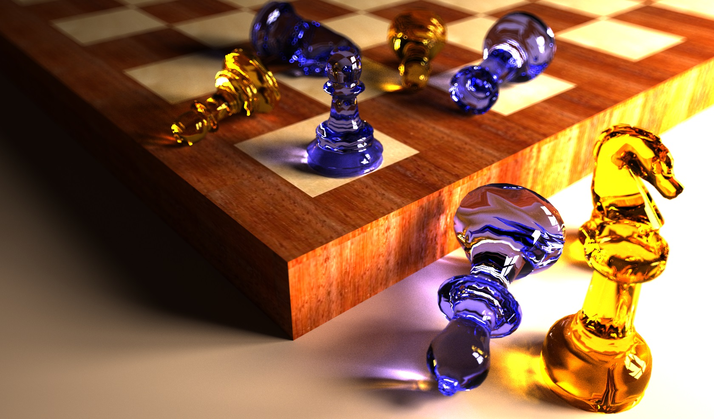
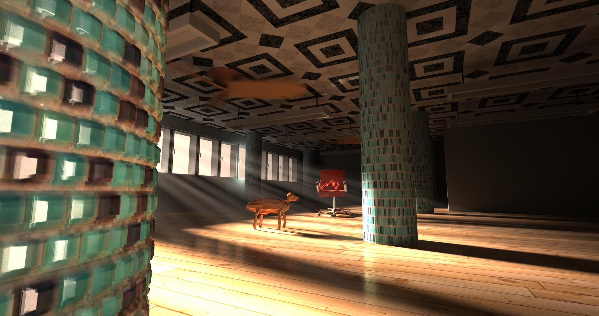

GraphicEngine8
==============
This is my hobby graphic-engine. I started 2006 with OpenGL-Games(2D / 3D) and 2010 with Raytracing. This engine can be used for 2D- and 3D-Games using OpenGL, DirectX or CPU-Rasterisation. It has also a Raytracer supporting local- and global illumination.

Images
------

Rendered with UPBP. Source from the scene: https://github.com/PetrVevoda/smallupbp/tree/master/scenes/stilllife

Depth of Field-Effect

Rendered with VCM.

Scene with Godrays. 

WaterBox

Snowman

Microfacet Sphere

Clouds

Lightsource with motion blure effect

MirrorBox

MirrorsEdge

Radiosity without color interpolation to see the patches

Material Testimage

Spheres illuminated with Image based lighting from HDR environment map

Features
--------
* 2D- and 3D-Output with OpenGL, DirectX, CPU-Rasterizer
* 3D-Output with Raytracing

* Raytracing-Methods:
	* Localillumination Raytracing
    * Pathtracing / Lighttracing / MediaPathtracing
	* Photonmapping / Progressive Photonmapping
	* Bidirectional Pathtracing
	* Vertex Connection & Merging
	* Unifying points, beams, and paths in volumetric light transport simulation
	* Multiplexed Metropolis Light Transport
	* Radiosity

* Brdf-Materials:
	* Diffuse
    * Glas, Mirror
	* Microfacet (Glas, Mirror)
	* Glossy
	
* Textures, UV-Mapping (From Wavefrontfile, Sphere-, Cube- Cylinder-Mapping), Procedural Textures

* Shader:
	* Normalmapping
    * Parallax Occlusion Mapping
	* Displacementmapping
	* Shadowmapping
	* Stencil-Shadows
	
* Participating media:
	* Homogeneos chromatic Media 
	* Atmosphere Model with Rayleigh and Mie Scattering
	* Uniform-, Henley-Greenstein- and Rayleigh phase functions
	* Distancesampling with RayMarching, WoodCockTracking
	* Clouds
	
* Camera:
    * Pinhole
    * Fisheye
	
* Lights:
    * Diffuse-Lightsources(Flat, Sphere, Every 3D-Object)
	* Diffuse with Importance
	* Direction-Lightsources (With and without opening angle in spot-direction)
	* Lightsource with Motionblure-Effect
    * Image based lighting from HDR environment maps.
	
* Tonemapping:
	* Gamma Only
	* Reinhard
	* Ward
	* HaarmPeterDuikersCurve
	* JimHejlAndRichardBurgessDawson
	* Uncharted2Tonemap
	* ACESFilmicToneMappingCurve
	
Dependencies
------------
* Newtonsoft.Json
* PowerArgs
* SlimDX
* Tao.OpenGL
* OpenTK
* MSTest
* FluentAssertions

Todo
----
* Spectral Raytracing
* Subsurface Scattering
* Hairs / Fure
* Collada File-Support
* GPU-Usage for Raytracing

Related work
------------
* smallpt: Global Illumination in 99 lines of C++ (https://www.kevinbeason.com/smallpt/)
* SmallVCM (http://www.smallvcm.com/)
* SmallUPBP (http://www.smallupbp.com/)

Usage
-----
* Open the Source/GraphicEngine8.sln-File with Vistual Studio 2019/2022 and Build to project
	* Go to Common->Tools and mark this project as startproject
	* Go to Settings->Debug->Arguments and paste SceneEditor ..\\..\\..\\..\\Data\\ SaveFolder
	* Press Strg+F5 to start the Application
	* Press 1,2,3,4 or 5 to create an image with OpenGL/DirectX/CPU-Rasterizer or the Raytracer
* Batch-Tools/2DTest.bat -> Demoapplication for 2D-Graphics (OpgenGL, DirectX, CPU-Rasterizer) 
	* Press 1,2,3 or 4 to switch between the outputmode
* Batch-Tools/3DTest.bat -> Demoapplication for 3D-Graphics (OpgenGL, DirectX, CPU-Rasterizer)
	* Press 1,2,3 or 4 to switch between the outputmode
* Scenes/*.bat -> This will start the Raytracer/Rasterizer to create a single image

Steps to create a own Raytracing-Image
--------------------------------------
* Create a Wavefront-File with Blender or 3DSMax
* Add a Description/Loading-Method in Tool->SceneEditor->Scenes.cs
	* Describe here which Wavefrontfile should be loaded
	* Describe the camera-position
	* Describe the lightsource / materials
* You can also describe the scene with wavefront-mtl and wavefront aux-files (See Data/19_Stilllife.mtl, 19_Stilllife.obj.aux)
* Call this method in the Tools->SceneEditor.cs and define the Render-Mode 
* Start the Raytracer in the SceneEditor by pressing space

License
-------

All rights reserved.
